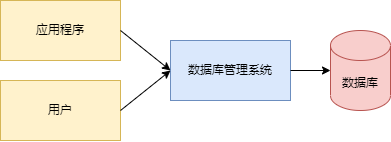
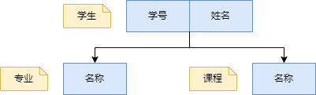
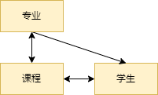
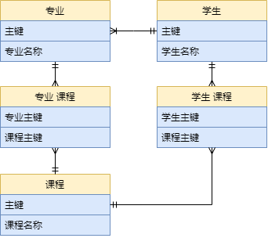
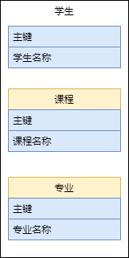
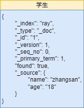
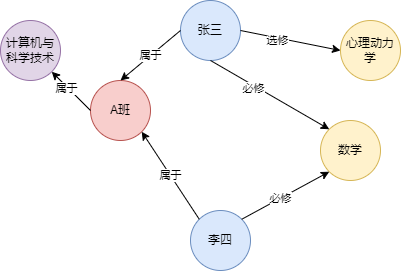

---
outline: deep
--- 
# 数据库是什么？为什么要用数据库？

你可能每天都在使用各种各样的数据，比如你的姓名、年龄、电话号码、地址、银行账户、购物记录、朋友圈动态等等。这些数据都是有用的信息，可以帮助你完成各种任务，比如打电话、网购、社交等等。但是，如果你把这些数据都放在一张纸上，或者一个文本文件里，你会发现很难管理和使用它们。比如，你想找出所有住在北京的朋友，或者你想统计一下你每个月花了多少钱，或者你想修改一下你的个人信息，你都需要花费很多时间和精力去查找、计算、修改数据。而且，如果你不小心把纸弄丢了，或者文件被删除了，你就会失去所有的数据。这样很不方便，也很不安全。

为了解决这些问题，人们发明了数据库（Database）。数据库是一种专门用来存储、管理和处理数据的软件系统。数据库可以把数据按照一定的规则和结构组织起来，方便用户查询、修改、删除和分析数据。数据库也可以保证数据的安全性和完整性，防止数据被误删或篡改。数据库还可以提高数据的效率和性能，让用户快速地获取所需的数据。

那么，数据库是怎么做到这些的呢？我们来看看数据库的基本知识。

## 数据库的组成

一个数据库系统通常由以下几个部分组成：

- 数据库：存储实际的数据，比如表、文档、图等。
- 数据库管理系统（Database Management System，DBMS）：负责管理数据库的软件，比如MySQL、MongoDB等。
- 数据库应用程序（Database Application Program）：与数据库交互的软件，比如网站、手机应用等。
- 数据库用户（Database User）：使用数据库的人或机器，比如管理员、开发者、客户等。

这些部分之间通过网络进行通信和协作，形成一个完整的数据库系统。



## 数据库的操作

一个数据库系统可以执行的基本操作为：

- 数据定义（Data Definition）：创建或修改数据库中的对象，比如表、索引、视图等。
- 数据操纵（Data Manipulation）：查询或修改数据库中的数据，比如插入、更新、删除等。
- 数据控制（Data Control）：管理数据库中的权限和安全性，比如授权、加密、备份等。
- 数据查询（Data Query）：查询数据库中的数据

这些操作通常通过一种特定的语言来实现，比如SQL语言。SQL语言类型有：

- 数据定义语言（DDL）：用于定义数据库对象，如表、视图、索引等。常用的DDL语句有CREATE、ALTER、DROP等
- 数据操作语言（DML）：用于对数据库中的数据进行增删改查。常用的DML语句有INSERT、DELETE、UPDATE、SELECT等
- 数据控制语言（DCL）：用于控制数据库的访问权限和事务处理等。常用的DCL语句有GRANT，REVOKE，COMMIT，ROLLBACK等
- 数据查询语言（DQL），用于从数据库中查询数据。DQL通常被认为是DML的一个子集，因为它只涉及SELECT语句

我们来看几个简单的例子：

- 创建一个名为student的表：

```sql
CREATE TABLE student (
  id INT PRIMARY KEY,
  name VARCHAR(20),
  age INT,
  gender CHAR(1)
);
```

- 向student表中插入一条数据：

```sql
INSERT INTO student VALUES (1, 'Alice', 18, 'F');
```

- 查询student表中所有女生的姓名和年龄：

```sql
SELECT name, age FROM student WHERE gender = 'F';
```

- 修改student表中id为1的学生的年龄为19：

```sql
UPDATE student SET age = 19 WHERE id = 1;
```

- 删除student表中id为1的学生：

```sql
DELETE FROM student WHERE id = 1;
```

- 给user用户授予student表的查询权限：

```sql
GRANT SELECT ON student TO user;
```

## 数据库的模型

一个数据库系统可以根据不同的方式来组织和表示数据，形成不同的数据库模型。常见的数据库模型有：

- 层次模型（Hierarchical Model）：把数据组织成树状结构，每个节点有一个父节点和多个子节点。层次模型简单易懂，但不适合表示复杂的关系。
- 网状模型（Network Model）：把数据组织成网状结构，每个节点可以有多个父节点和多个子节点。网状模型灵活强大，但不易于理解和维护。
- 关系模型（Relational Model）：把数据组织成表格结构，每个表由行和列组成。关系模型清晰规范，但不适合表示非结构化或半结构化的数据。
- 面向对象模型（Object-oriented Model）：把数据组织成对象结构，每个对象由属性和方法组成。面向对象模型适合表示复杂和动态的数据，但不易于查询和分析。
- 文档模型（Document Model）：把数据组织成文档结构，每个文档由键值对组成。文档模型适合表示非结构化或半结构化的数据，但不易于保证数据完整性和一致性。
- 图模型（Graph Model）：把数据组织成图结构，每个节点由属性组成，并通过边与其他节点连接。图模型适合表示复杂和多对多的关系，但不易于扩展和优化。

我们来看几个简单的例子：

- 层次模型：



- 网状模型：



- 关系模型：



- 面向对象模型：



- 文档模型：



- 图模型：



## 数据路的分类

- 关系型数据库（Relational Database）
- 非关系型数据库（Non-relational Database）
- 分布式数据库（Distributed Database）
- 云数据库（Cloud Database）

### 关系型数据库

关系型数据库是最常见和最传统的一种数据库类型。它把数据存储在一个或多个表（Table）中，每个表由行（Row）和列（Column）组成。每一行代表一个数据项（Record），每一列代表一个数据属性（Field）。表之间可以通过主键（Primary Key）和外键（Foreign Key）建立联系，形成复杂的关系（Relation）。关系型数据库使用结构化查询语言（Structured Query Language，SQL）来操作数据。SQL是一种通用的、标准化的、简单的语言，可以让用户方便地查询、修改、删除和分析数据。

关系型数据库的优点是：

- 数据结构清晰，易于理解和使用。
- 数据完整性和一致性高，可以避免数据冗余和错误。
- SQL语言功能强大，支持复杂的查询和分析。
- 支持事务（Transaction）处理，可以保证数据的安全性和可靠性。

关系型数据库的缺点是：

- 数据库设计和维护较为复杂，需要遵循严格的规范和约束。
- 数据库扩展性和灵活性较低，不适合存储非结构化或半结构化的数据。
- 数据库性能受到硬件资源的限制，不适合处理海量或高并发的数据。

常见的关系型数据库有：MySQL、Oracle、SQL Server、PostgreSQL等。

### 非关系型数据库

非关系型数据库是近年来兴起的一种新型数据库类型。它不使用表来存储数据，而是使用其他的方式，比如文档（Document）、键值对（Key-value Pair）、图（Graph）、列族（Column Family）等等。非关系型数据库不需要遵循固定的结构和规则，可以灵活地存储各种类型和格式的数据。非关系型数据库通常不使用SQL语言来操作数据，而是使用各自特定的语言或接口。

非关系型数据库的优点是：

- 数据库设计和维护简单，无需预先定义数据结构。
- 数据库扩展性和灵活性高，可以适应不同的业务需求和变化。
- 数据库性能高，可以处理海量或高并发的数据。

非关系型数据库的缺点是：

- 数据完整性和一致性低，可能存在数据冗余或错误。
- 通用性差，不支持标准化的语言或接口。
- 功能有限，不支持复杂的查询和分析。

常见的非关系型数据库有：MongoDB、Redis、Neo4j、Cassandra等。

### 分布式数据库

分布式数据库是一种将数据分散存储在多个物理节点上，并通过网络进行协调和交互的数据库类型。分布式数据库可以提高数据的可用性和可靠性，并提高系统的容错能力和负载均衡能力。分布式数据库根据节点之间的通信方式可以分为同步分布式数据库（Synchronous Distributed Database）和异步分布式数据库（Asynchronous Distributed Database）。同步分布式数据库要求节点之间实时地同步数据状态，并保证数据在任何时刻都是一致的。异步分布式数据库允许节点之间存在一定程度的延迟，并容忍数据在某些时刻出现不一致。

分布式数据库面临着一个重要而困难的问题：如何在保证系统可用性（Availability）、一致性（Consistency）和分区容错性（Partition Tolerance）三者之间取得平衡？这个问题被称为CAP定理（CAP Theorem），它指出，在一个分布式系统中，只能同时满足其中两个条件。因此，在设计分布式数据库时，需要根据具体场景选择合适的方案。常见的方案有：

- ACID方案（Atomicity, Consistency, Isolation, Durability），强调数据的一致性和可靠性，适合处理事务性强的业务，比如银行、电商等。代表产品有：Google Spanner、CockroachDB等。
- BASE方案（Basically Available, Soft state, Eventual consistency），强调数据的可用性和灵活性，适合处理实时性强的业务，比如社交、游戏等。代表产品有：Amazon DynamoDB、Facebook Cassandra等。
- PACELC方案（Partition, Availability/Consistency, Else, Latency/Consistency），强调数据的分区容错性和延迟敏感性，适合处理分布式场景下的业务，比如云计算、物联网等。代表产品有：Alibaba OceanBase、PingCAP TiDB等 。

### 云数据库

云数据库是一种将数据库部署在云计算平台上，并提供按需、按量付费的数据库服务的数据库类型。云数据库可以让用户无需自己搭建和管理数据库，而是通过网络访问云端的数据库资源，享受高效、便捷、安全、经济的数据库服务。云数据库根据服务层次可以分为三种类型：

- 数据库即服务（Database as a Service，DBaaS），提供基础的数据库功能，比如存储、查询、备份等，用户只需关注数据本身，无需管理数据库软件和硬件。代表产品有：Azure SQL Database、AWS RDS等。
- 数据仓库即服务（Data Warehouse as a Service，DWaaS），提供高级的数据分析功能，比如数据挖掘、机器学习、可视化等，用户只需关注数据价值，无需管理数据仓库软件和硬件。代表产品有：Google BigQuery、Snowflake等。
- 数据库平台即服务（Database Platform as a Service，DBPaaS），提供灵活的数据库开发功能，比如自定义数据模型、业务逻辑、接口等，用户只需关注数据应用，无需管理数据库开发软件和硬件。代表产品有：Firebase、Parse等。