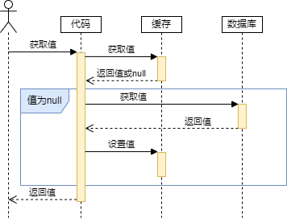
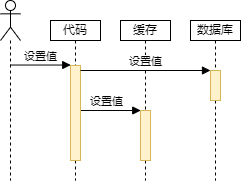
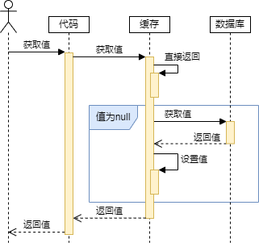
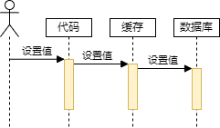
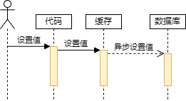
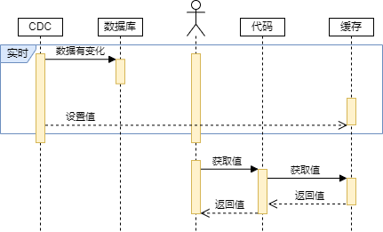
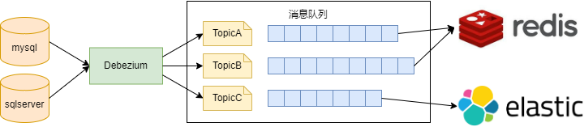

# 缓存更新策略

缓存更新是指在数据发生变化时，保持缓存和数据库的数据一致性的问题。如果缓存和数据库的数据不一致，会导致用户看到过期或者错误的数据，影响业务逻辑和用户体验。

为了实现缓存更新，我们可以采用以下四种方式：

- **Cache Aside策略**：应用程序直接**与数据库和缓存交互**，并负责维护缓存的一致性
    - 查询：先查询缓存，如果缓存中没有，则查询数据库，并将结果写入缓存
    - 更新：先更新数据库，然后删除缓存或者更新缓存
- **Read/Write Through策略**：应用程序**只和缓存交互**，而是使用缓存与数据库交互
    - 查询：先查询缓存，如果缓存中没有，则缓存从数据库中加载数据，并写入缓存
    - 更新：先更新缓存，再由缓存同步更新数据库
- **Write Behind 策略**：应用程序**只和缓存交互**。当有数据更新时，**只更新缓存**，不直接更新数据库，改为**异步的方式**更新数据库
- **Refresh-Ahead策略**：应用程序**只和缓存交互**，由后台服务与数据库交互
    - 查询：只查询缓存
    - 更新：由后台服务**自动从数据库中查询最新的数据**，并将数据写入缓存中，
    
    不同**于以上三种**，应用程序**无需等待**数据的刷新，也无需自己去触发数据的刷新，而是后台服务来完成这些操作

## Cache Aside

Cache Aside策略上文已经介绍过了，它是通过**应用层面**来实现的，分为两种场景：

- Cache Aside查询策略
- Cache Aside更新策略

### Cache Aside查询策略

如下图所示：通过代码查询缓存，缓存命中则返回，如果没有命中则查询数据库并设置值

### Cache Aside更新策略

如下图所示：通过代码更新缓存，先更新数据库，后更新缓存

这种策略简单易用，但是需要维护缓存和数据库的一致性，可能出现缓存穿透或缓存雪崩的问题，一般采用**延迟双删**来保证最终一致性

### 延迟双删

延迟双删是一种保证数据一致性的常用策略，它的基本思想是在更新数据库后，先删除缓存，然后等待一段时间，再次删除缓存。这样做的目的是为了防止在数据库和缓存主从同步的过程中，有其他请求查询到旧的缓存数据，并写回到缓存中，具体的流程如下：

1. 更新数据库数据
2. 删除缓存数据
3. 休眠一段时间，时间依据数据的读取耗费的时间而定。
4. 再次删除缓存数据

**延迟双删的休眠时间**是根据业务读取数据平均耗时来设置的，目的是确保读请求可以结束，写请求可以删除读请求造成的脏数据的问题。一般来说，休眠时间可以设置为**500毫秒**左右，但具体还要**根据实际情况调整**。休眠时间设置过长会影响性能和实时性，设置过短会导致数据不一致的风险。

延迟双删的优点是简单易实现，能够提高数据的**最终一致性**。但是延迟双删的**缺点**也非常明显：

- 延迟双删**不是强一致性**，有**等待环节**，如果系统要求低延时，这种场景就不合适了
- 延迟双删不适合“秒杀”这种**频繁修改数据和要求数据强一致**的场景
- 延迟双删的延时时间是一个预估值，不能确保数据库和redis在这个时间段内都实时同步或持久化成功了
- 延迟双删不能完全避免redis存在脏数据的问题，只能减轻这个问题，要想彻底解决，还需要用到**同步锁**解决

## Read/Write Through

Read/Write Through只与缓存做交互，分为两种场景：

- Read/Write Through查询策略
- Read/Write Through更新策略

### Read/Write Through查询策略

如下图所示：先查询缓存，如果缓存没有，由**缓存**去数据库查询，而不是**应用层**，查询后更新缓存

### Read/Write Through更新策略

如下图所示：先更新缓存，再由缓存同步更新数据库

## Write Behind 

Write Behind 策略是指在写入数据时，只更新缓存中的数据，然后建立一个**异步任务或者定时任务**来批量更新数据库中的数据。这样，应用程序无需等待数据库的响应，也无需自己去同步更新数据库和缓存，而是交由缓存服务来完成这些操作，如下图所示：

## Refresh-Ahead

是指在读取数据时，**如果缓存中的数据即将过期**，则由**后台线程或服务**自动从数据库中查询最新的数据，并将数据写入缓存中，然后返回给应用程序。**不同于以上三种**，应用程序**无需等待**数据的刷新，也无需自己去触发数据的刷新，而是交由**后台线程或服务**来完成这些操作。其中`后台线程或服务`的实现通常是使用**CDC**模式去实现的

Refresh-Ahead 模式的工作原理如下：

- 当客户端访问缓存中的某个数据时，首先检查该数据**是否即将过期**，如果是，则启动一个**后台线程或服务**去从数据库中获取最新的数据，并**替换**掉缓存中的旧数据；同时返回给客户端
- 如果该数据还**没有即将过期**，则直接返回给客户端
- 如果该数据项**已经过期**，则从数据库中**获取最新的数据**，并**替换**掉缓存中的旧数据，并返回给客户端新数据

### CDC

CDC，全称为Change Data Capture。它是一种软件设计模式，通过监测数据变更(新增、修改、删除等)而对变更的数据进行进一步处理的一种设计模式。CDC 可以帮助实现数据同步、数据仓库加载、数据分析等场景

CDC 的优点：

- **提高数据访问的性能和效率**，因为它避免了**重复地查询整个数据集**，而只需要获取**增量数据**
- **提高数据一致性和可靠性**，因为它可以**及时地将数据源的变化同步到下游系统**，避免了数据过期或丢失的风险
- **提高数据分析和洞察的能力**，因为它可以**实时地反映**数据的状态
- **提高数据集成和转换的灵活性和可扩展性**，因为它可以适应**不同类型和结构的数据源**和目标，支持多种场景和用例。

CDC 的应用场景：

- **数据同步**：可将数据源中的变化同步到其他**数据库或数据存储**中，例如缓存、搜索索引、备份等。
- **数据仓库加载**：可将数据源中的变化加载到**数据仓库或数据湖**中，支持离线或实时的数据分析和报告。
- **数据分析**：可将数据源中的变化发送到**流式处理平台或机器学习平台**中，支持实时或批量的数据处理和建模
- **数据触发**：可将数据源中的变化作为**触发器**，激活其他系统或服务中的业务流程或逻辑，例如通知、审计、验证等

CDC 的实现方式有多种，其中比较成熟的开源项目就是Debezium。它为CDC提供了一套低延迟的数据流平台支持多种数据库。例如：MongoDB、MySQL、PostgreSQL、SQL Server、Oracle等等。使用Debezium监控数据源，并使用Kafka作为消息服务，将数据源的变化作为事件发送到缓存。这样，缓存可以**异步地接收和处理数据**变化，而不需要定期地查询数据源

cdc_redis

## 四种策略的选择

我们介绍了四种常见的缓存更新策略：`Cache Aside`、`Read/Write Through` 、`Write Behind Caching` 、`Refresh-Ahead`。在实际应用时，应该结合具体业务和应用场景来选择合适的缓存策略，接下来我们通过对比性能、数据一致性、冗余数据、代码复杂度、业务逻辑、可靠性这几个点来说明：

|策略|性能|一致性|冗余数据|代码复杂度|业务逻辑 |可靠性|
|-|-|-|-|-|-|-|
|Cache Aside|较高|较低|较少|较高|较复杂|较低|
|Read/Write Through|较低|最高|较多|最高|最简单|最高|
|Write Behind Caching|最高|最低|较少|较低|较简单|较高|
|Refresh-Ahead|次高|次高|较多|最高|较复杂|最高|

> 注意：
Refresh-Ahead策略是假定无CDC的情况下进行对比的

### 性能

- `Cache Aside` 的性能较高，它**只在缓存未命中**时才访问数据库
- `Read/Write Through` 的性能较低，它在**每次读写时都需要访问数据库**
- `Write Behind Caching` 的性能最高，它**只在缓存未命中**时才访问数据库，而**写入操作是异步的**
- `Refresh-Ahead` 的性能介于 `Cache Aside` 和 `Write Behind Caching` 之间，它**只在即将过期时**才访问数据库，并且**写入操作也是异步的**

### 数据一致性

- `Cache Aside` 的数据一致性较低，它**只在缓存未命中时**才更新缓存，而写入操作则是**直接更新数据库**，**并将缓存中的数据删除或更新**
- `Read/Write Through` 的数据一致性最高，它在**每次读写时都**更新数据库和缓存
- `Write Behind Caching` 的数据一致性最低，它**只在缓存未命中**时才更新缓存，而写入操作则是先更新缓存，并在**异步更新数据库**，有较大的延迟。
- `Refresh-Ahead` 的数据一致性介于 `Read/Write Through` 和 `Cache Aside` 之间，它保证了缓存中的数据**总是最新**的，但是有一定的延迟

### 冗余数据

- `Cache Aside` 的冗余数据较少，它**只将经常访问的数据**保存到缓存中
- `Read/Write Through` 的冗余数据较多，它需要将数据库的**所有数据**都保存到缓存中
- `Write Behind Caching` 的冗余数据与 `Cache Aside` 相同，因为它也**只将经常访问的数据**保存到缓存中
- `Refresh-Ahead` 的冗余数据与 `Read/Write Through` 相同，它也需要将数据库的**所有数据**都保存到缓存中

### 代码复杂度

- `Cache Aside` 的代码复杂度较高，它需要**同时与缓存和数据库**交互，并处理可能出现的异常情况
- `Read/Write Through` 的代码复杂度最高，它需要实现数据库的读写接口
- `Write Behind Caching` 的代码复杂度较低，它只需要实现**简单的缓存操作**，并在异步执行数据库写入操作
- `Refresh-Ahead` 的代码复杂度与 `Read/Write Through` 相同，他它需要实现数据库的读写接口（关于这点可以使用Debezium）

### 业务逻辑

- `Cache Aside` 的业务逻辑较复杂，它需要**同时与缓存和数据库**交互，且返回的数据是最新的
- `Read/Write Through `的业务逻辑最简单，它**只与缓存**交互，且返回的数据是最新的
- `Write Behind Caching` 的业务逻辑较简单，它也**只与缓存**交互，且返回的数据是最新的，由于是异步更新，所以比`Read/Write Through`要复杂一些
- `Refresh-Ahead `的业务逻辑较复杂，它会**同时与缓存和数据库**交互，需要处理可能出现的**异常情况**，且返回的数据有可能是**旧的**，也有可能是**新的**（关于这点也可以使用Debezium）

### 可靠性

- `Cache Aside` 的可靠性较低，因为它将缓存作为数据库的**辅助层**
- `Read/Write Through` 的可靠性最高，因为它将缓存作为数据库的**代理层**
- `Write Behind Caching` 的可靠性较高，因为它将缓存作为数据库**前置层**
- `Refresh-Ahead` 的可靠性与 `Read/Write Through` 相同，因为它也将缓存作为数据库的**代理层**