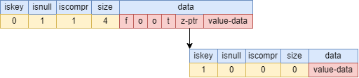
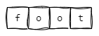
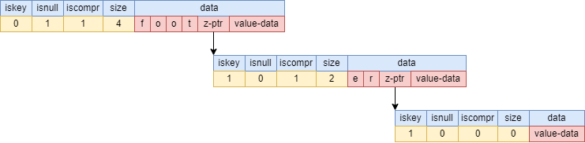
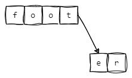
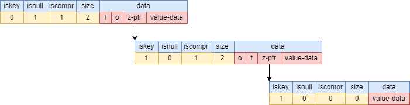
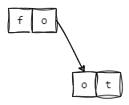
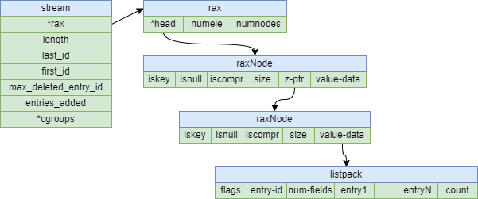

# 五种特殊数据类型

## 概述
Redis 是一个开源的高性能键值数据库，它支持多种数据类型，可以满足不同的业务需求。接下来本文介绍五种特殊数据类型，分别是
- stream（流）
- geospatial（地理）
- bitmap（位图）
- bitfield（位域）
- hyperloglog（基数统计）

## Stream
stream 是一个类似于日志的数据结构，它可以记录一系列的键值对，每个键值对都有一个唯一的 ID。一个 stream 类型的键最多可以存储 2^64 - 1 个键值对。

stream 类型的底层实现是 rax（基数树），它是一种压缩的前缀树结构，它将所有的键值对按照 ID 的字典序存储在一个树形结构中。rax 可以快速地定位、插入、删除任意位置的键值对

### 应用场景

stream 类型的应用场景主要是实现事件驱动的架构，比如：

- 消息队列，利用 xadd 和 xread 命令实现生产者消费者模式。
- 操作日志，利用 xadd 和 xrange 命令实现操作记录和回放。
- 数据同步，利用 xadd 和 xreadgroup 命令实现多个消费者组之间的数据同步。

### 底层原理

#### Rax Tree

**rax tree**是一种基于基数树（**radix tree**）的变体，也叫做压缩前缀树（compressed prefix tree）,它被应用于**redis stream**中，用来存储**streamID**，其数据结构为

```C
typedef struct raxNode {
    uint32_t iskey:1;     /* Does this node contain a key? */
    uint32_t isnull:1;    /* Associated value is NULL (don't store it). */
    uint32_t iscompr:1;   /* 前缀是否压缩 */
    uint32_t size:29;     /* Number of children, or compressed string len. */
    unsigned char data[];
} raxNode;
```

- `iskey`：是否包含key
- `isnull`：是否存储value值
- `iscompr`：前缀是否压缩。决定了`size`存储的是什么和`data`的数据结构
- `size`：
    - `iscompr=0`：节点为**非压缩节点**，`size`是孩子节点的数量
    - `iscompr=1`：节点为**压缩节点**，`size`是已压缩的字符串长度
- `data`：
    - `iscompr=0`：节点为**非压缩节点**，数据格式为`[header strlen=0][abc][a-ptr][b-ptr][c-ptr](value-ptr?)`。其有size个字符，
    - `iscompr=1`：节点为**压缩节点**，数据格式为`[header strlen=3][xyz][z-ptr](value-ptr?)`。


为了便于理解，设定一些场景举例说明

**场景一：只插入foot**

数据结构为：




其中，`z-ptr`指向的叶子节点的`iskey=1`，标识`foot`这个key。下图为使用树状图的形式来展现其数据结构


**场景二：插入foot后，插入footer**

数据结构为：




其插入过程为：

1. 与**foot**节点中每个字符进行比较，获得最大公共前缀`foot`
2. 将**er**作为**foot**的子节点，其`iskey=1`，标识`foot`这个key
3. 将**er**的子节点的`iskey=1`，标识`footer`这个key

下图为使用树状图的形式来展现其数据结构


**场景三：插入foot后，插入fo**

数据结构为：




其插入过程为：

1. 与**foot**节点中每个字符进行比较，获得最大公共前缀`fo`
2. 将**foot**拆成**fo**和**ot**
3. 将**ot**作为**fo**的子节点，其`iskey=1`，标识`fo`这个key
4. 设置**ot**的子节点的`iskey=1`，标识`foot`这个key

下图为使用树状图的形式来展现其数据结构


**场景四：插入foot后，插入foobar**

数据结构为：


其插入过程为：

1. 与**foot**节点中每个字符进行比较，获得最大公共前缀`foo`
2. 将**foot**拆成**foo**和**t**
3. 将**footbar**拆成**foo**、**b**、**ar**
4. 将**t**、**b**作为**foo**的子节点
5. 设置**ot**的子节点的`iskey=1`，标识`foot`这个key
6. 将**ar**作为**b**的子节点
7. 设置**ar**的子节点的`iskey=1`，标识`footbar`这个key

下图为使用树状图的形式来展现其数据结构


#### Stream

**stream**的底层使用了`rax tree`和`listpack`两种结构，`rax tree`用来存储streamID，而`listpack`用来存储对应的值，结构图如下：




## Hyperloglog
HyperLogLog 是一种概率数据结构，用于在恒定的内存大小下估计集合的基数（不同元素的个数）。它不是一个独立的数据类型，而是一种特殊的 string 类型，它可以使用极小的空间来统计一个集合中不同元素的数量，也就是基数。一个 hyperloglog 类型的键最多可以存储 12 KB 的数据

hyperloglog 类型的底层实现是 SDS（simple dynamic string），它和 string 类型相同，只是在操作时会使用一种概率算法来计算基数。hyperloglog 的误差率为 0.81%，也就是说如果真实基数为 1000，那么 hyperloglog 计算出来的基数可能在 981 到 1019 之间

### 应用场景

hyperloglog 类型的应用场景主要是利用空间换时间和精度，比如：

- 统计网站的独立访客数（UV）
- 统计在线游戏的活跃用户数（DAU）
- 统计电商平台的商品浏览量
- 统计社交网络的用户关注数
- 统计日志分析中的不同事件数

假如需要统计某商品的用户关注数，可以通过以下方式：

```Bash
> PFADD goodA "1"
1
> PFADD goodA "2"
1
> PFADD goodA "3"
1
> PFCOUNT goodA
3

```

## GEO
geospatial 是一种用于存储和查询地理空间位置的数据类型，它基于 sorted set 数据结构实现，利用 geohash 算法将经纬度编码为二进制字符串，并作为 sorted set 的 score 值。Redis geospatial 提供了一系列的命令来添加、删除、搜索和计算地理空间位置，例如：


- `GEOADD key longitude latitude member [longitude latitude member …]`：将一个或多个地理空间位置（经度、纬度、名称）添加到指定的 key 中
- `GEOPOS key member [member …]`：返回一个或多个地理空间位置的经纬度

- `GEODIST key member1 member2 [unit]`：返回两个地理空间位置之间的距离，可以指定单位（m, km, mi, ft）

- `GEORADIUS key longitude latitude radius unit [WITHCOORD] [WITHDIST] [WITHHASH] [COUNT count] [ASC|DESC] [STORE key] [STOREDIST key]`：返回指定圆心和半径内的地理空间位置，可以指定返回坐标、距离、哈希值、数量、排序方式等，也可以将结果存储到另一个 key 中

- `GEORADIUSBYMEMBER key member radius unit [WITHCOORD] [WITHDIST] [WITHHASH] [COUNT count] [ASC|DESC] [STORE key] [STOREDIST key]`: 返回以指定成员为圆心的指定半径内的地理空间位置，其他参数同 `GEORADIUS`

### 应用场景

geospatial 的应用是地理位置搜索、分析和展示，例如地图应用、导航应用、位置服务应用等。例如，可以使用 geospatial 来实现以下功能：

- 统计某个区域内的商家或用户数量
- 查询某个位置附近的餐馆或酒店
- 计算两个位置之间的距离或行驶时间
- 显示某个位置周围的景点或活动

## Bitmap

`bitmap `不是一个独立的数据类型，而是一种特殊的 string 类型，它可以将一个 string 类型的值看作是一个由二进制位组成的数组，并提供了一系列操作二进制位的命令。一个 bitmap 类型的键最多可以存储 2^32 - 1 个二进制位。

bitmap 类型的底层实现是 SDS（simple dynamic string），它和 string 类型相同，只是在操作时会将每个字节拆分成 8 个二进制位。

### 应用场景

bitmap 类型的应用场景主要是利用二进制位的特性，比如：

- 统计用户活跃度，利用 setbit 和 bitcount 命令实现每天或每月用户登录次数的统计。
- 实现布隆过滤器，利用 setbit 和 getbit 命令实现快速判断一个元素是否存在于一个集合中。
- 实现位图索引，利用 bitop 和 bitpos 命令实现对多个条件进行位运算和定位

假如需要统计每个用户的当天登录次数统计。

首先，需要规定**bitmap**的格式，假设为`{userid}:{年份}:{第几天} {秒数} {是否登录}`

> 将`userid`为100的用户，记录他在2024年第100天中第1秒，是否登录

```Bash
SETBIT 1000:2024:100 1 1
0

```

> 将`userid`为100的用户，记录他在2024年第100天中第10240 秒，是否登录

```Bash
SETBIT 1000:2024:100 10240 1
0
```

> 将`userid`为100的用户，记录他在2024年第100天中第86400 秒，是否登录

```Bash
SETBIT 1000:2024:100 86400 1
0
```

> 统计`userid`为100的用户，在2024年第100天的登录次数

```Bash
BITCOUNT 1000:2024:100
3
```

## Bitfield
`bitfield`结构是基于字符串类型的一种扩展，可以让你对一个字符串中的任意位进行设置，增加和获取操作，就像一个位数组一样

可以操作任意位长度的整数，从**无符号的1位整数**到**有符号的63位整数**。这些值是使用二进制编码的`Redis`字符串来存储的

`bitfield`结构支持原子的读，写和增加操作，使它们成为管理计数器和类似数值的好选择

### 应用场景

`Bitfield`的使用场景与`bitmap `类似，主要是一些需要用不同位长度的整数来表示状态或属性的场合，例如：

- 用一个32位的无符号整数来表示用户的金币数量，用一个32位的无符号整数来表示用户杀死的怪物数量，可以方便地对这些数值进行设置，增加和获取
- 用一个16位的有符号整数来表示用户的等级，用一个16位的有符号整数来表示用户的经验值，可以方便地对这些数值进行设置，增加和获取

- 用一个8位的无符号整数来表示用户的性别，用一个8位的无符号整数来表示用户的年龄，可以方便地对这些数值进行设置，增加和获取

`bitfield`和`bitmap`都是基于`string`类型的位操作，但是有一些区别：

- `bitmap`只能操作1位的无符号整数，而`bitfield`可以操作任意位长度的有符号或无符号整数
- `bitmap`只能设置或获取指定偏移量上的位，而`bitfield`可以对指定偏移量上的位进行增加或减少操作
- `bitmap`可以对多个字符串进行位运算，而`bitfield`只能对单个字符串进行位操作
- `bitmap`的偏移量是从0开始的，而`bitfield`的偏移量是从最高有效位开始的

例如，使用`bitfield`存储用户的个人信息，

- 用一个8位的无符号整数来表示用户的性别，0表示男，1表示女
- 用一个8位的无符号整数来表示用户的年龄，范围是0-255
- 用一个16位的无符号整数来表示用户的身高，单位是厘米，范围是0-65535
- 用一个16位的无符号整数来表示用户的体重，单位是克，范围是0-65535

假设有一个用户，性别是女，年龄是25，身高是165厘米，体重是50千克，可以用以下命令来存储和获取这些信息：

```Bash
> BITFIELD user:1:info SET u8 #0 1 SET u8 #1 25 SET u16 #2 165 SET u16 #3 50000
0
0
0
0
```

然后，获取这个用户的信息，性别、年龄、身高、体重

```Bash
> BITFIELD user:1:info GET u8 #0 GET u8 #1 GET u16 #2 GET u16 #3
1
25
165
50000
```
