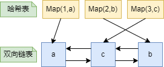
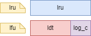

# Redis内存兜底策略——内存淘汰及回收机制

Redis内存淘汰及回收策略都是Redis**内存优化兜底**的策略，那它们是如何进行**兜底**的呢？先来说明一下什么是内存淘汰和内存回收策略：

- Redis内存淘汰：当Redis的内存使用**超过配置**的限制时，根据一定的策略删除一些键，以**释放内存空间**
- Redis内存回收：Redis通过**定期删除**和**惰性删除**两种方式来清除过期的键，以保证数据的时效性和**减少内存占用**

## 内存淘汰策略

Redis内存淘汰策略是指当Redis的内存使用超过配置的最大值时，如何选择一些键进行删除，以释放空间给新的数据。Redis提供了八种内存淘汰策略，分别是：

- **noeviction**：不会淘汰任何键，达到内存限制后返回错误
- **allkeys-random**：在所有键中，随机删除键
- **volatile-random**：在设置了过期时间的键中，随机删除键
- **allkeys-lru**：通过LRU算法淘汰**最近最少使用**的键，保留最近使用的键
- **volatile-lru**：从设置了过期时间的键中，通过LRU算法淘汰**最近最少使用**的键
- **allkeys-lfu**：从所有键中淘汰**使用频率最少**的键。从所有键中驱逐使用频率最少的键
- **volatile-lfu**：从设置了过期时间的键中，通过LFU算法淘汰**使用频率最少**的键
- **volatile-ttl**：从设置了过期时间的键中，淘汰**马上就要过期**的键

### LRU和LFU

LRU（least recently used）算法为**最近最少使用**算法，根据数据的历史访问记录来进行淘汰数据，优先移除**最近最少使用**的数据，这种算法认为**最近使用的数据很大概率将会再次被使用**

LFU（least frequently used）算法为**最少频率使用**算法，优先**移除使用频率最少**的数据，这种算法认为**使用频率高的数据很大概率将会再次被使用**

### LRU和Redis的近似LRU

LRU（least recently used）算法为**最近最少使用**算法，根据数据的历史访问记录来进行淘汰数据，优先移除**最近最少使用**的数据，这种算法认为**最近使用的数据很大概率将会再次被使用**

#### 什么是LRU

在算法的选择上，Redis需要能够快速地**查询、添加、删除**数据，也就是说**查询、添加、删除**的时间复杂读需为O(1)。哈希表能保证查询数据的时间复杂度为O(1)。而双向链表能保证**添加、删除**数据的时间复杂度为O(1)，如下：



#### Redis的近似LRU

如前文所述，真实的 LRU 算法需要用链表管理所有的数据，每次访问一个数据就要移动链表节点，这样会占用额外的空间和时间。而Redis通过**近似 LRU** 算法，随机抽样一些键，然后比较它们的访问时间戳，这样可以节省内存和提高性能。而Redis 的近似 LRU 算法的具体实现如下：

- 每个键值对对象（`redisObject`）中有一个 24 位的 lru 字段，用于记录每个数据最近一次被访问的时间戳
- 每次按键获取一个值的时候，都会调用 `lookupKey `函数，如果配置使用了 LRU 模式，该函数会更新 value 中的 lru 字段为当前秒级别的时间戳
- 当内存达到限制时，Redis 会维护一个候选集合（`pool`），大小为 16
- Redis 会随机从字典中取出 N 个键（N 可以通过 `maxmemory-samples` 参数设置，默认为 5），将 lru 字段值最小的键放入候选集合中，并按照 lru 大小排序
- 如果候选集合已满，那么新加入的键必须有比集合中**最大的 lru 值更小的 lru 值**，才能替换掉原来的键
- 当需要淘汰数据时，直接从候选集合中**选择一个 lru 最小的键**进行淘汰

举个例子，假设我们按照下面的顺序访问缓存中的数据：`h,e,l,l,o,w,o,r,l,d`且内存中只能存储**3个字符**，下面是每次访问或插入后缓存的状态，其中括号内是lru字段的值，假设初始时间戳为0

|缓存|状态|
|-|-|
|访问h|h(0)|
|访问e|e(1),h(0)|
|访问l|l(2),e(1),h(0)|
|访问l|l(3),e(1),h(0)|
|插入o|o(4),l(3),e(1)|
|插入w|w(5),o(4),l(3)|
|访问o|o(6),w(5),l(3)|
|插入r|r(7),o(6),w(5)|
|插入l|l(8),r(7),o(6)|
|插入d|d(9),l(8),r(7)|


### LFU

LFU（Least Frequently Used）是最不经常使用算法，它的思想是淘汰访问频率最低的数据。Redis在3.0版本之后引入了LFU算法，并对lru字段进行了拆分。

```C
typedef struct redisObject {
    unsigned type:4;
    unsigned encoding:4;
    unsigned lru:LRU_BITS;
    int refcount;
    void *ptr;
} robj;
```

我们看`lru:LRU_BITS`这个字段，这个字段在**LRU算法**中的意义是时间戳，精确到秒。而在**LFU 算法**中，将它拆为两部分前16bits为时间戳，精确到分；后8为则表示该对象在一定时间段内被访问的次数。如下：



当Redis需要淘汰数据时，它会从内存中随机抽取一定数量（默认为5个，可以通过 `maxmemory-samples` 参数设置）的键值对对象，然后比较它们的访问次数和访问时间戳，找出其中最小的那个，也就是最不经常使用且最早被访问的那个，将其从内存中删除。

例如，假设我们有以下键值对和频率计数器：

|键|值|频率|
|-|-|-|
|A|1|3|
|B|2|2|
|C|3|1|
|D|4|4|


如果我们要添加一个新的键值对（E,5），并且缓存已经满了，那么我们就需要淘汰一个旧的键值对。我们可以随机选择A,B,C中的一个，并且发现C的频率最低，为1，所以我们就淘汰C，并且添加E到缓存中，并且将E的频率设为1。这样，缓存中的数据就变成了：

|键|值|频率|
|-|-|-|
|A|1|3|
|B|2|2|
|D|4|4|
|E|5|1|


### 如何选择

在选择上，需要根据不同的适用场景选择不同策略，如下：

|策略|特点|适用场景|
|-|-|-|
|noeviction|不删除任何数据，当内存不足时返回错误|数据都是永久有效的，且内存足够大|
|allkeys-lru|根据所有数据的访问时间来淘汰最久未访问的数据|数据都是永久有效的，且访问时间具有明显规律|
|volatile-lru|根据设置了过期时间的数据的访问时间来淘汰最久未访问的数据|数据都有过期时间，且访问时间具有明显规律|
|allkeys-random|随机淘汰所有类型的数据|数据都是永久有效的，且访问时间没有明显规律|
|volatile-random|随机淘汰设置了过期时间的数据|数据都有过期时间，且访问时间没有明显规律|
|volatile-ttl|根据设置了过期时间的数据的剩余生命周期来淘汰即将过期的数据|数据都有过期时间，且剩余生命周期具有明显规律|
|allkeys-lfu|根据所有数据的访问频率来淘汰最少访问的数据|数据都是永久有效的，且访问频率具有明显规律|
|volatile-lfu|根据设置了过期时间的数据的访问频率来淘汰最少访问的数据|数据都有过期时间，且访问频率具有明显规律|


根据8种策略的特性，也从**数据完整性**、**缓存命中率**及**淘汰效率**这三个方面详细对比了，如下：

- **数据完整性**（是否会删除永久有效的数据)
    - `noeviction` 、 `volatile-lru`、`volatile-lfu`和`volatile-random` 都可以保证数据完整性，因为它们**不会删除永久有效的数据**
    - `allkeys-lru`、`allkeys-lfu`和`allkeys-random`系列的策略则会影响数据完整性，因为它们会无差别地删除所有类型的数据
- **缓存命中率**（是否能够尽可能保留最有价值的数据）
    - `allkeys-lru` 和 `volatile-lru` 策略可以**提高缓存命中率**，因为它们会根据数据的访问时间来淘汰数据
    - `allkeys-random` 和 `volatile-random` 策略则会**降低缓存命中率**，因为它们会随机淘汰数据
    - `allkeys-lfu` 和 `volatile-lfu` 策略也**可以提高缓存命中率**，因为它们会根据数据的访问频率来淘汰数据
    - `volatile-ttl` 策略则会`降低缓存命中率`，因为它会根据数据的剩余生命周期来淘汰数据
- **淘汰效率**（是否能够快速地找到并删除目标数据）
    - `allkeys-random` 和 `volatile-random` 策略可以提高执行效率，因为它们只需要随机选择一些数据进行删除
    - `allkeys-lru` 和 `volatile-lru` 策略则会降低执行效率，因为它们需要对所有或部分数据进行排序
    - `allkeys-lfu` 和 `volatile-lfu` 策略也会降低执行效率，因为它们需要对所有或部分数据进行计数和排序
    - `volatile-ttl` 策略则会提高执行效率，因为它只需要对设置了过期时间的数据进行排序

## 内存回收策略

Redis的过期键删除有两种方式，一种是定期删除，一种是惰性删除

### 惰性删除

Redis惰性删除是指当一个键过期后，它并不会立即被删除，而是在**客户端尝试访问这个键时，Redis会检查这个键是否过期，如果过期了，就会删除这个键**。惰性删除由`db.c/expireIfNeeded`函数实现。

惰性删除的优点是节约CPU性能，发现必须删除的时候才删除。缺点是内存压力很大，出现长期占用内存的数据。惰性删除是Redis的默认策略，它不需要额外的配置。

惰性删除的缺点是可能会导致过期键长时间占用内存，如果访问频率较低的键过期了，但没有被访问到，那么它们就不会被惰性删除，从而浪费内存空间。

为了解决这个问题，Redis还采用了定期删除和内存淘汰机制来配合惰性删除，以达到更好的清理效果

### 定期删除

Redis会将设置了过期时间的键放到一个独立的字典中，称为过期字典。Redis会对这个字典进行每秒10次（由配置文件中的hz参数控制）的过期扫描，过期扫描不会遍历字典中所有的键，而是采用了一种简单的贪心策略。该策略的删除逻辑如下：

- 从过期字典中随机选择20个键
- 删除其中已经过期的键
- 如果超过25%的键被删除，则重复步骤1
- 如果本次扫描耗时超过1毫秒，则停止扫描

这种策略可以在一定程度上保证过期键能够及时被删除，同时也避免了对CPU时间的过度占用。但是它也有一些缺点，比如可能会误删一些有效的键（因为随机性），或者漏删一些无效的键（因为限制了扫描时间）

因此，Redis还结合了惰性删除策略，即在每次访问一个键之前，都会检查这个键是否过期，如果过期就删除，然后返回空值。这样可以保证不返回过期的数据，也可以节省CPU时间，但是它可能会导致一些过期的键长期占用内存，如果这些键很少被访问或者一直不被访问，那么它们就永远不会被删除

## 配置文件说明

Redis内存淘汰、内存回收策略相关的配置文件如下：

```.properties
# 内存淘汰策略
maxmemory-policy noeviction
# 抽取数量
maxmemory-samples 5
# 最大内存
maxmemory 100mb
# 内存淘汰韧性
maxmemory-eviction-tenacity 10
# 后台任务执行间隔
hz 10
# 是否开启动态间隔
dynamic-hz yes

```

配置文件说明:

- maxmemory-policy：内存淘汰策略，可选值为noeviction、allkeys-random、volatile-random、allkeys-lru、volatile-lru、allkeys-lfu、volatile-lfu、volatile-ttl其中的一个
- maxmemory：默认值为0，也就是不限制内存的使用。
- maxmemory-samples：抽取数量，默认为5，如果设为10将非常接近真实的LRU，但需要更多CPU资源，如果设为3将非常快，但是非常不准确。
- maxmemory-eviction-tenacity：内存淘汰韧性，默认为10
    - maxmemory-eviction-tenacity为0时，表示不进行任何淘汰，相当于noeviction策略
    - maxmemory-eviction-tenacity为10时，表示每次淘汰键的数量为内存使用量的0.1%，每秒最多淘汰10次
- hz：Redis后台任务执行间隔，如超时关闭客户端连接、定期删除等。默认值为10。范围在 1 到 500 之间，官方建议不要超过100，大多数应使用默认值，并且只有在极低延迟的环境中才能设为 100
- dynamic-hz：此配置用于动态调整hz的值，默认开启。如果有大量客户端连接进来时，会以`hz`的配置值将作为基线，将hz的实际值设置为hz的配置值的整数倍，用来节省CPU资源。

## 总结

总结如下：

- Redis内存淘汰机制是指在Redis的用于缓存的内存不足时，怎么处理需要新写入且需要申请额外空间的数据
- Redis提供了八种内存淘汰策略，分别是：
    - noeviction：不会淘汰任何键，达到内存限制后返回错误
    - allkeys-random：在所有键中，随机删除键
    - volatile-random：在设置了过期时间的键中，随机删除键
    - allkeys-lru：通过LRU算法淘汰最近最少使用的键，保留最近使用的键
    - volatile-lru：从设置了过期时间的键中，通过LRU算法淘汰最近最少使用的键
    - allkeys-lfu：从所有键中淘汰使用频率最少的键。从所有键中驱逐使用频率最少的键
    - volatile-lfu：从设置了过期时间的键中，通过LFU算法淘汰使用频率最少的键
    - volatile-ttl：从设置了过期时间的键中，淘汰马上就要过期的键
- Redis内存回收机制是指在Redis中如何删除已经过期或者被淘汰的数据，释放内存空间
- Redis提供了两种内存回收策略，分别是：
    - 定期删除：Redis会每隔一定时间（默认100ms）随机抽取一些设置了过期时间的键，检查它们是否过期，如果过期就删除。这种策略可以减少CPU开销，但可能会导致一些过期键占用内存
    - 惰性删除：Redis在客户端访问一个键时，会检查这个键是否过期，如果过期就删除。这种策略可以及时释放内存空间，但可能会增加CPU开销和延迟