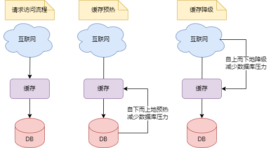

# 缓存预热和限流
## 前言

缓存预热是指在系统启动或重启后，提前将相关的数据加载到缓存中，在用户请求时，减少对数据库访问造成压力

缓存降级是指在系统压力过大或者出现故障时，为了保证核心服务的可用，降低或者关闭一些非核心服务的缓存功能

这两种策略放在一起的原因为：它们都是为了**减少系统压力**而提出的。缓存预热是**自下而上**地减少数据库压力，而缓存降级是**自上而下**地减少数据库压力。如下图：

## 缓存预热

缓存预热就是在系统启动或重启后，提前将相关的数据加载到Redis中，避免在用户请求时，先查询数据库，然后再将数据写入缓存的过程。这样可以减少数据库的压力，提高用户的体验，防止出现缓存未命中的情况

缓存预热是指在系统启动或者重启后，将相关的缓存数据提前加载到缓存系统中，避免在用户请求时，先查询数据库，然后再将数据缓存的问题。用户直接查询事先被预热的缓存数据，提高响应速度和用户体验。

实际上我们可以这么理解：**防止系统压力过大，从而先将数据提前放到缓存中**

缓存预热总体来说需要三个步骤：收集、分析、预热。

- 收集：收集需要预热的数据
- 分析：将收集的数据进行分析，如是否要进行分类，是否需要指定策略进行。目的就是为了**削峰、增加缓存命中率**
- 预热：具体的实施方案，需要考虑**数据一致性、所消耗的资源**等等

### 步骤1——收集

收集就是根据**历史访问记录、业务规则、数据更新频率**等因素，确定哪些数据是热点数据

- 基于历史访问记录：通过分析历史访问日志或者监控数据，找出访问频率最高或者最近最高的数据，作为热点数据进行预热
- 基于业务规则：通过定义一些业务规则或者策略，确定哪些数据是热点数据或者重要数据，例如根据商品的销量、评分、推荐度等因素进行预热
- 基于数据更新频率：通过检测数据的更新时间或者变化程度，确定哪些数据是热点数据或者动态数据，例如根据新闻的发布时间、点击量、评论数等因素进行预热

可采取的实现方式如下：

- 利用**业务经验**，预估哪些是热点key，并在客户端或者服务端进行单独缓存或者备份
- **利用代理层或者抓包工具**，监听和解析redis客户端和服务端的通信协议，**统计和上报热点key**，如nginx+lua
- **利用redis自带的命令**，如`monitor`或者`hotkeys`，实时抓取和分析redis服务器接收到的命令，找出访问频率最高的key

### 步骤2——分析

分析需要结合业务场景和数据的特征，可以通过**数据量、数据类型、数据有效期、数据更新频率**等维度来制定合适的缓存策略

例如，可以根据业务数据有效期进行**分类错峰**，A类60分钟，B类50分钟，C类40分钟，过期时间使用**固定时间+随机值**的形式，**稀释集中到期的key的数量**。也可以对**超热数据使用永久key或者设置较长的过期时间**

### 步骤3——预热

预热就是将收集和分析好的数据加载到缓存中，提高缓存命中率，降低数据库压力，本文将分为6种方式进行说明，分别为：

- 手动预热
- 定时预热
- 异步预热
- 实时预热
- 双缓存策略预热
- 分布式加载

#### 手动预热

手动预热是最简单也最直接的方式，就是在系统启动前或重启后，通过脚本或命令行手动将数据库中的数据查询出来，并写入到Redis中。

这种方式的优点是简单易操作，可以根据需要选择要预热的数据和时间。缺点是需要人工干预，不能自动化，也不能及时反映数据的变化

#### 定时预热

定时预热是通过设置一个定时任务，在固定的时间间隔或时间点，自动执行缓存预热的逻辑。

这种方式的优点是可以自动化，不需要人工干预，也可以根据业务规律设置合理的时间间隔或时间点。缺点是可能会造成缓存和数据库之间的数据不一致，也可能会浪费资源和带宽

#### 异步预热

利用消息队列异步实现数据预热。可以使用消息队列（如Kafka、RabbitMQ等）作为中间件，当数据库中的数据发生变化时，将变化的数据更新到Redis中

这种方式的优点是可以**保证缓存和数据库之间的数据一致性**，也可以及时反映数据的变化。缺点是**需要额外的组件和逻辑来实现消息队列或事件驱动机制**，**也会增加系统的复杂度和延迟**

#### 实时预热

通过拦截用户的请求，收集热点数据，实时计算后，通过分布式锁保证多个服务器之间的数据一致性，可选的实施方式如下：

1. 收集：可以通过**代理层**（例如nginx+lua）方式，在用户请求到达Web服务器时，将请求日志实时上报到消息队列中（例如Kafka）
2. 实时计算：利用分布式流式计算框架（例如Storm），从消息队列中消费请求日志，并进行实时分析和处理
3. 留存队列：利用LRU算法维护一个访问次数最多的数据列表。
4. 定时处理：指定一个较短的时间间隔（比如每分钟执行一次）。通过分布式锁（如通过ZooKeeper调度）来保证多个服务器之间的数据一致性

#### 双缓存策略预热

双缓存策略预热是通过设置两个缓存层来实现，一个是主缓存层，一个是备份缓存层。主缓存层设置较短的过期时间，备份缓存层设置较长或不设置过期时间

当用户访问某个数据时，先从主缓存层查询，如果命中则直接返回；如果未命中，则从备份缓存层查询，并更新到主缓存层；如果备份缓存层也未命中，则从数据库中查询，并更新到主缓存层和备份缓存层

这种方式的优点是可以避免大量数据同时过期造成的雪崩效应，也可以**保证数据的可用性和一致性**。缺点是需要维护两个缓存层，**增加了系统的复杂度和资源消耗**

#### 分布式加载

分布式加载是通过将数据分片或分区，在多个节点上并行地进行缓存预热。这种方式的优点是可以提高缓存预热的速度和效率，也可以避免单点故障和压力过大。缺点是需要设计合理的分片或分区策略，也需要协调多个节点之间的通信和同步

利用分布式多服务器同时进行数据读取，提速数据加载过程

## 选取正确的预热策略

下面，本文将通过`热点数据覆盖率`、`数据一致性`、`资源消耗`、`逻辑复杂度及适用场景`这几点，分析这六种缓存预热方式，如下

|策略|热点数据覆盖率|数据一致性|资源消耗|逻辑复杂度|适用场景|
|-|-|-|-|-|-|
|手动预热|低|高|低|低|数据变化不频繁的场景|
|定时预热|高|低|高|低|数据变化不频繁的场景|
|异步预热|低|高|低|高|数据变化频繁的场景|
|实时预热|高|高|高|高|数据变化频繁的场景|
|双缓存|高|高|高|高|数据量大且访问频繁的场景|
|分布式|最高|最高|最低|最高|数据量巨大且访问极其频繁的场景|

## 缓存降级

缓存降级是指在系统压力过大或者出现故障时，为了保证核心服务的可用，降低或者关闭一些非核心服务的缓存功能。缓存降级有四种常见的方案，分别是

- 静态化处理
- 限流熔断
- 多级缓存
- 集群和负载均衡

### 静态化处理

静态化处理就是将一些热点数据或者页面提前生成静态文件，存放在CDN或者本地服务器上，当缓存服务不可用时，直接返回静态文件给用户，从而减少对数据库的访问。这种方案适用于一些数据变化不频繁，但是访问量很大的场景，比如首页、商品详情页、新闻资讯等

优点：

- 提高了系统的响应速度和可用性，降低了数据库的压力
- 减少了对缓存服务的依赖，增强了系统的容错能力
- 简化了系统的架构和部署，节省了资源和成本

缺点：

- 增加了数据更新和维护的复杂度，需要定期生成和同步静态文件
- 不能满足一些动态变化或者个性化的需求，可能导致用户体验下降
- 可能存在数据不一致或者过期的风险，需要合理设计过期策略

### 限流熔断

限流熔断是指通过一些技术手段，对系统的请求进行限制和拦截，当请求量超过系统的承载能力时，拒绝部分请求或者返回降级结果。这种方案适用于一些请求量波动较大，但是对响应速度和数据一致性要求较高的场景，比如秒杀、抢购、优惠券等

优点：

- 防止了系统过载和崩溃，保证了核心业务的正常运行
- 优化了系统资源的利用率和分配效率，提高了系统的吞吐量
- 提升了用户对系统的信任度和满意度，减少了用户流失

缺点：

- 增加了系统开发和测试的难度和成本，需要设计合理的限流算法和熔断策略
- 不能完全避免请求失败或者超时的情况，需要提供友好的提示和补偿机制
- 可能影响部分用户或者功能的正常使用，需要平衡好业务需求和系统负载

### 多级缓存

多级缓存是指在系统中设置多层缓存结构，从近到远依次为本地缓存、分布式缓存、数据库缓存等。当某一层缓存服务不可用时，可以从下一层缓存中获取数据，从而提高数据命中率和可靠性。这种方案适用于一些数据访问频率不均匀，但是对数据实时性要求不高的场景，比如用户信息、订单信息、评论信息等

优点：

- 缩短了数据访问的距离和时间，提升了系统性能和用户体验
- 降低了单个缓存服务的压力和风险，增加了系统容量和稳定性
- 增加了数据备份和恢复的能力，减少了数据丢失和损坏的可能性

缺点：

- 增加了系统设计和实现的复杂度和成本，需要协调好各层缓存之间的关系
- 增加了数据同步和更新的难度和开销，需要设计合理的失效策略和通知机制
- 增加了数据不一致或者脏读的概率，需要考虑好数据一致性和最终一致性

### 集群和负载均衡

集群和负载均衡是指将单个缓存服务拆分为多个节点组成一个集群，并通过负载均衡器将请求分发到不同节点上。当某个节点出现故障时，可以自动切换到其他节点上继续提供服务。这种方案适用于一些请求量很大且均匀分布，并且对数据一致性要求较高的场景，比如购物车、收藏夹、浏览记录等

集群和负载均衡的优点有：

- 扩展了系统规模和容量，并行处理更多请求
- 提高了系统可用性和容错性，并自动恢复故障节点
- 保证了数据一致性和完整性，并支持事务操作

集群和负载均衡的缺点有：

- 增加了系统部署和运维的难度和成本，需要配置好集群参数和负载策略
- 增加了网络通信和数据传输的开销和延迟，并可能引入单点故障
- 增加了数据冲突和竞争锁定等问题，并可能影响并发性能

## **选取**正确的降级策略

下面，本文将通过`数据访问频率`、`数据一致性`、`复杂度`、`性能和可用性`这几点，分析这六种缓存降级方式，如下

|方案|数据访问频率|数据一致性|复杂度|性能和可用性|
|-|-|-|-|-|
|静态化处理|高|低|低|低|
|限流熔断|高|高|高|低|
|多级缓存|不均匀|低|低|高|
|集群负载均衡|均匀|高|高|高|

