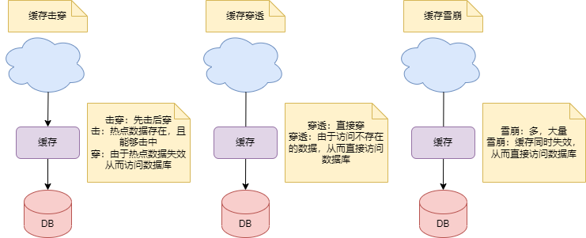

# 缓存击穿、穿透、雪崩及解决方案

Redis是一种高性能的键值型数据库，它可以用来实现缓存功能，提高应用的响应速度和承载能力。但是，使用Redis缓存也会遇到一些常见的问题，比如缓存击穿、缓存穿透、缓存雪崩。这些问题都会影响缓存的效率和稳定性，所以需要了解它们的原因和解决方案，保障Redis能够正常运行。

## 击穿、穿透、雪崩的意思

击穿、穿透、雪崩这三个词语很容易混淆，本文先对词语进行理解，再讲解技术

击穿：击穿拆开后，是击和穿。**击意为敲打，或做类似敲打的动作**。**穿意为穿透**

击是什么？如下图，**攻击**的意思

穿是什么？如下图，穿透，造成的效果就是个**洞**

雪崩的意思很简单，就是一个字**多**，如下图

白话讲解一下，击穿就是**先击后穿**；穿透就是**穿透，有个洞**；雪崩就是**多，很多很多**

再从技术角度说明击穿、穿透、雪崩

击穿意为先击后穿。热点数据存在，且能够击中。但是由于热点数据失效从而访问数据库

穿透意为直接穿。由于访问不存在的数据，从而直接访问数据库

雪崩意为多，大量。大量缓存同时失效，从而直接访问数据库

## 缓存击穿

缓存击穿的定义：某个**热点数据**在缓存中**过期或失效**时，大量的请求同时访问该数据，导致**数据库压力过大甚至崩溃**的现象。通常会发生在数据**更新频率较高**或者缓存设置了**相同的过期时间**的时候。

实际上可以这么理解：**应该有的数据但是没读到，从而击穿了缓存，直接访问数据库**

可采取的方案：

- **不设置过期时间或设置较长的过期时间**：这样可以避免热点数据同时失效，但是也会增加**内存占用和数据不一致的风险**
- **定时更新**。比如这个热点数据的过期时间是 2 小时，那么每到 1小时50 分钟时，通过定时任务去更新这个热点 key，并重新设置其过期时间
- **互斥锁**：当缓存中没有数据时，只允许一个线程去数据库查询并更新缓存，其他线程等待该线程完成后再从缓存中获取数据。这样可以减少对数据库的并发访问，但是也会**降低系统的吞吐量和响应速度**
- **分布式锁**：当多个Redis节点存在时，可以使用分布式锁来保证只有一个节点去数据库查询并更新缓存，其他节点等待该节点完成后再从缓存中获取数据。这样可以避免多个Redis节点同时访问数据库，但是也会**增加系统的复杂度和延迟**

## 缓存穿透

缓存穿透的定义：

用户查询一个**不存在的数据**，导致缓存中没有该数据，每次都要去数据库查询，而数据库中也没有该数据，造成**无效的查询和资源浪费**的现象。通常会发生在**用户恶意攻击或者参数校验**不严格的时候

实际上可以这么理解：**不应该有的数据非要读，从而穿透了缓存，直接访问数据库**

可采取的方案：

- **业务层校验**。用户发过来的请求，根据请求参数进行校验，对于明显错误的参数，直接拦截返回。比如请求参数为主键自增 id ，那么对于请求小于 0 的 id 参数， 明显不符合业务逻辑。
- **缓存空值**：当数据库中没有查询到数据时，仍然**将空值或者默认值**写入缓存，并设置一个**较短的过期时间**。这样可以减少对数据库的访问次数，但也会**占用一定的内存**
- **使用布隆过滤器**：布隆过滤器是一种概率型的数据结构，它可以判断一个元素是否可能存在于一个集合中。可以将所有可能存在的数据的键值哈希到一个足够大的位图中，当用户查询一个数据时，**先用布隆过滤器判断该键值是否可能存在**，如果不存在则直接返回，如果存在则再去缓存和数据库中查询。这样可以有效地拦截不存在的数据请求，但是也会有一定的误判率和内存开销

## 缓存雪崩

缓存雪崩的定义：在某个时间点，大量的缓存数据同时失效或者缓存服务器宕机，导致所有的请求都要去数据库查询，造成数据库压力过大甚至崩溃的现象。这种情况通常发生在缓存设置了相同或者相近的过期时间或者缓存服务器遭遇意外故障的场景下。

实际上可以这么理解：**大量数据读取，从而使缓存雪崩，直接访问数据库**

为了防止缓存雪崩，可以采用的方法：

- **设置不同的过期时间**。可以给缓存设置不同或者随机的过期时间，避免大量的缓存同时失效，造成数据库压力突增
- **缓存预热**：对于即将来临的大量请求，可以将数据提前缓存在Redis中，并设置不同的过期时间
- **使用多级缓存**：可以构建多级缓存架构，比如Nginx缓存+Redis缓存+本地缓存等，当某一级缓存出现问题时，可以从其他级别的缓存中获取数据，增加系统的容错能力
- **使用限流熔断**：可以利用一些限流和熔断组件，对请求进行限流和降级处理，当请求超过系统能承受的阀值时，直接拒绝或者返回默认值，保护数据库不被打垮
- **使用集群和负载均衡**：可以将Redis部署成集群模式，并使用负载均衡组件，比如LVS、HAProxy等，对请求进行分发和转发，提高Redis的可用性和并发能力

## 总结

本文介绍了缓存击穿、缓存穿透和缓存雪崩三种问题及解决方案。通过本文，可以了解到：
 - 缓存击穿：先击后穿
 - 缓存击穿的解决方案有：设置热点数据永不过期、定时更新、分布式
 - 缓存穿透：将缓存穿了个洞
 - 缓存穿透的解决方案有：业务层校验、缓存空值、布隆过滤器
 - 缓存雪崩：大量失效Key
 - 缓存雪崩的解决方案有：设置不同的过期时间、缓存预热、多级缓存、限流熔断、集群和负载均衡

